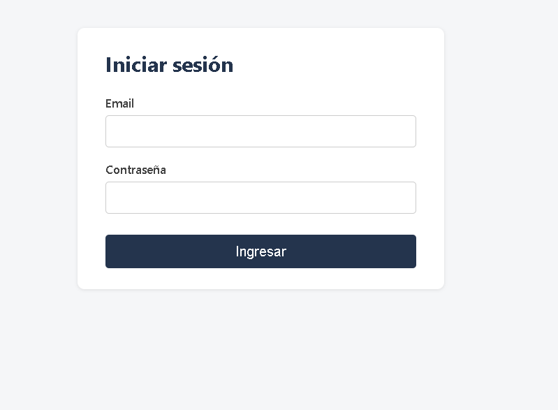
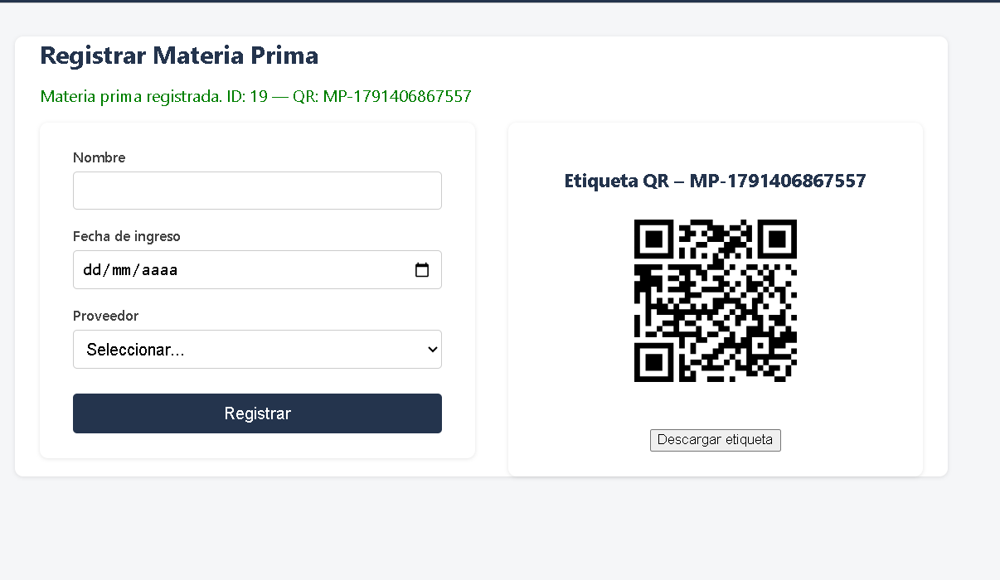
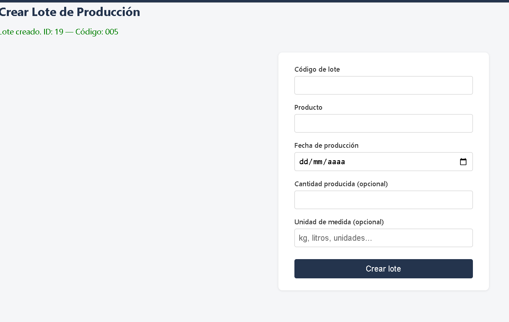
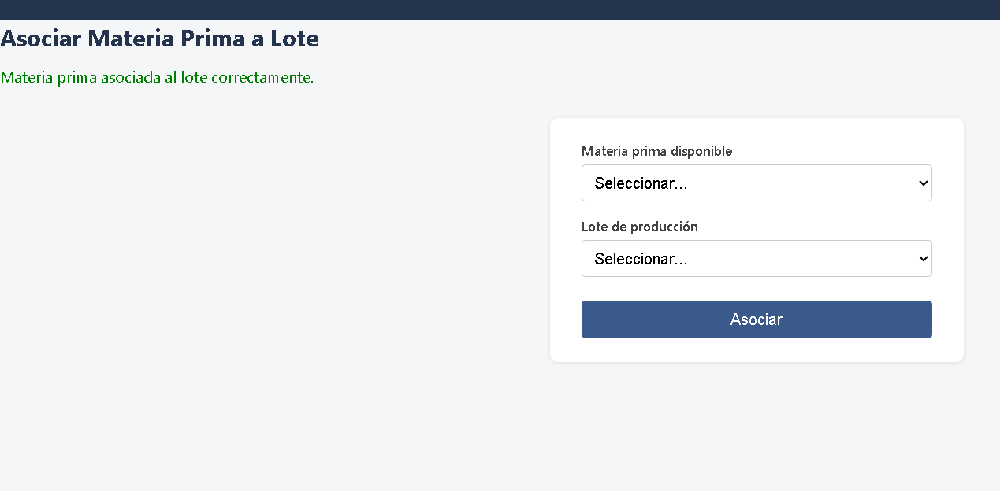
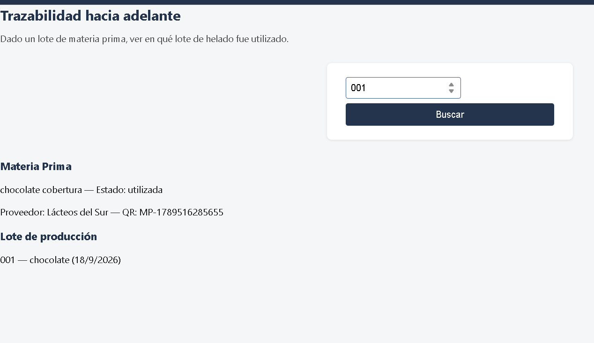
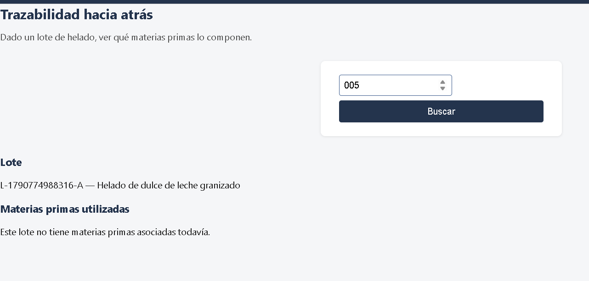
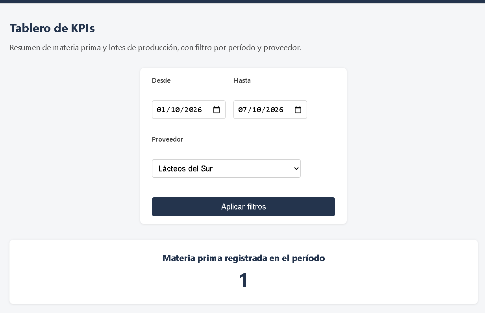
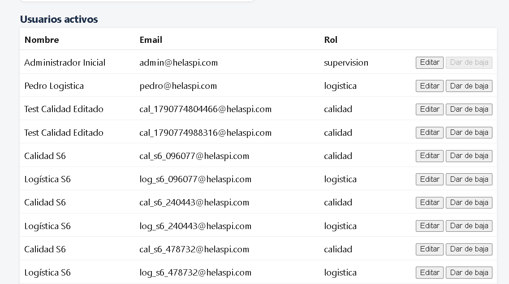
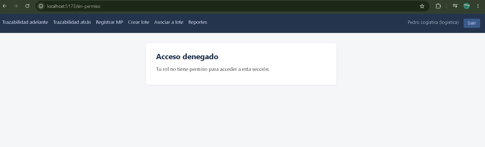

# Manual de usuario — Sistema de Trazabilidad por QR (Helaspi)

## Roles del sistema

| Rol | Puede hacer |
|---|---|
| **Calidad** | Registrar materia prima, consultar trazabilidad y reportes |
| **Logística** | Crear lotes de producción, asociar materia prima a un lote, consultar trazabilidad y reportes |
| **Supervisión** | Todo lo anterior, más la gestión de usuarios |

Si intentás entrar a una sección que no corresponde a tu rol, el sistema te muestra la pantalla **"Acceso denegado"** y no te deja continuar.

## 1. Iniciar sesión

Entrá a la URL del sistema (`http://localhost:5173` en la misma PC, o `http://IP_DE_LA_PC:5173` desde otro dispositivo en la misma red) e ingresá tu email y contraseña.

## 2. Registrar materia prima (Calidad, Supervisión)

Menú **"Registrar MP"**. Completá nombre, fecha de ingreso y proveedor. Al registrar, el sistema genera automáticamente un **código QR** para esa materia prima y lo muestra al lado del formulario, con un botón para descargar la etiqueta (PNG) e imprimirla.

El QR codifica un link directo a la trazabilidad de esa materia prima. Escaneándolo con la cámara de cualquier celular (conectado a la misma red) se abre directamente la trazabilidad hacia adelante, sin tener que tipear el ID a mano.

## 3. Crear lote de producción (Logística, Supervisión)

Menú **"Crear lote"**. Completá código de lote, producto, fecha de producción y, opcionalmente, cantidad producida y unidad de medida.

## 4. Asociar materia prima a un lote (Logística, Supervisión)

Menú **"Asociar a lote"**. Elegís una materia prima **disponible** (las ya utilizadas no aparecen en la lista) y el lote al que corresponde.

Una vez asociada, esa materia prima pasa a estado `utilizada` y ya no puede reasignarse a otro lote ni editarse (se bloquea para no perder la trazabilidad).

## 5. Trazabilidad

### Hacia adelante (Calidad, Logística, Supervisión)
Dada una materia prima, muestra en qué lote de producción se usó (o que todavía no fue utilizada). Se llega escaneando el QR de la etiqueta, o buscando el ID a mano en **"Trazabilidad adelante"**.

### Hacia atrás (Calidad, Logística, Supervisión)
Dado un lote de producción, muestra qué materias primas lo componen y de qué proveedor vino cada una. Se busca por ID de lote en **"Trazabilidad atrás"**.

## 6. Tablero de reportes (Calidad, Logística, Supervisión)

Menú **"Reportes"**. Muestra 4 indicadores: materia prima registrada en el período, materia prima por proveedor, lotes por estado, y materia prima utilizada vs. disponible. Se puede filtrar por rango de fechas y por proveedor.

## 7. Gestión de usuarios (solo Supervisión)

Menú **"Usuarios"**, visible solo para Supervisión. Si Calidad o Logística intentan entrar escribiendo la URL `/usuarios`, el sistema muestra "Acceso denegado". Supervisión puede ver el listado de usuarios activos, crear uno nuevo (nombre, email, contraseña y rol), editar nombre/email/rol de uno existente, o darlo de baja. No podés darte de baja a vos mismo.

## 8. Acceso denegado

Si un rol sin permiso intenta entrar a una sección restringida (por ejemplo, Logística entrando a "Usuarios"), ve esta pantalla:

